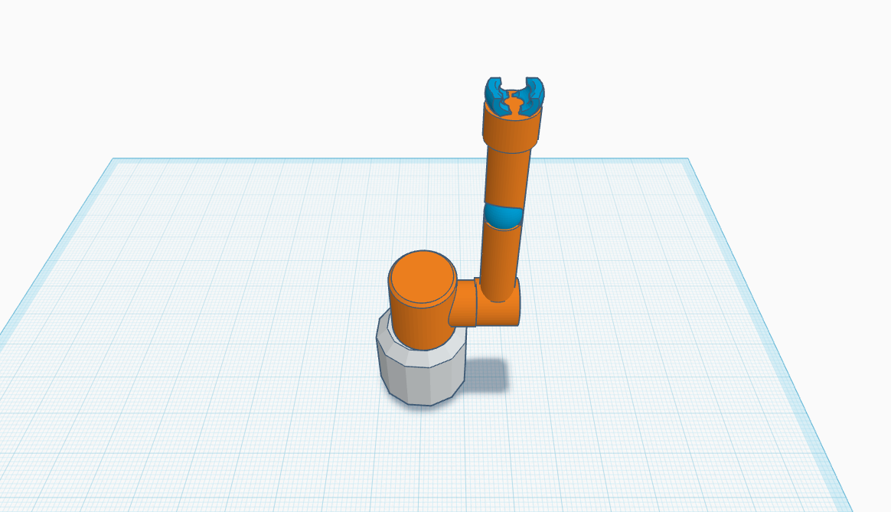

#  3D Robotic Arm Design – 5 Degrees of Freedom

##  Project Overview

This is a 3D robotic arm model designed using **Tinkercad**. The arm consists of **5 Degrees of Freedom (DOF)**, allowing it to simulate various movements similar to a human arm.

---

##  Degrees of Freedom (DOF)

1. **Base Rotation**  
   - Movement: Full rotation  
   - Range: **360°**

2. **Shoulder Joint**  
   - Movement: Up and down  
   - Range: **180°**

3. **Elbow Joint**  
   - Movement: Bending  
   - Range: **90°**

4. **Wrist Rotation**  
   - Movement: Rotates clockwise and counter-clockwise  
   - Range: **360°**

5. **Gripper (Claw)**  
   - Movement: Opens and closes to grip objects  
   - Range: **Open/Close**

---

##  Design Components

- **Base**: Rotational platform that supports the entire arm.
- **Shoulder Joint**: Lifts the upper part of the arm.
- **Elbow Joint**: Adds bending movement in the middle of the arm.
- **Wrist Joint**: Provides rotational control near the gripper.
- **Gripper (Claw)**: End-effector to pick up and release objects.

---

##  Preview Image

---

